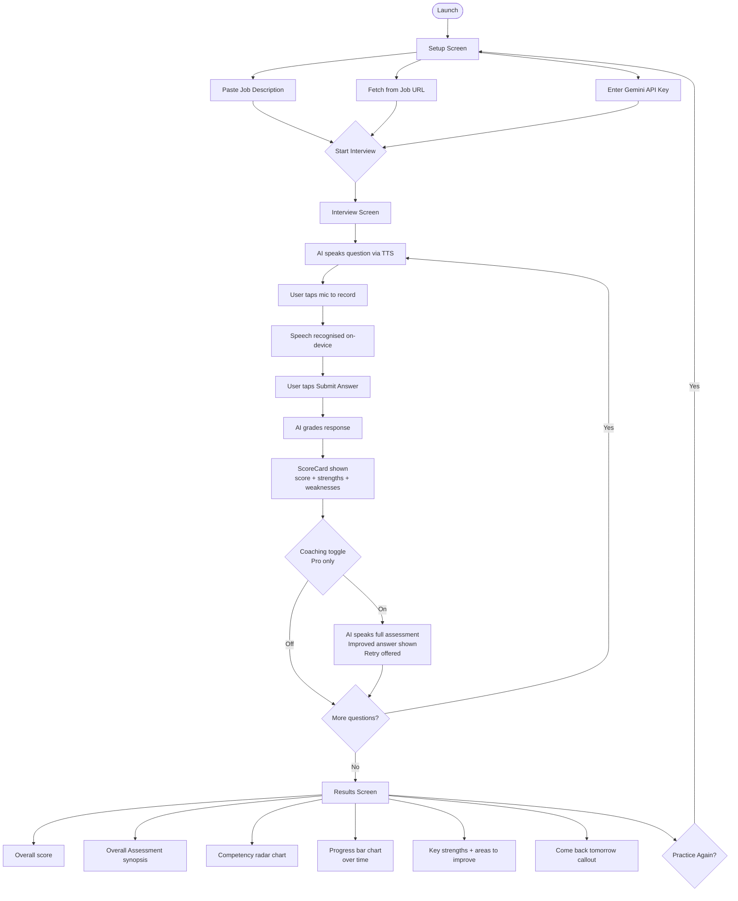

# AI Interviewer

> Practice job interviews with AI-powered questions, real-time speech recognition, and personalized coaching feedback.


---

## Overview

AI Interviewer is a cross-platform mobile app (iOS + Android) that helps job seekers prepare for interviews by simulating a real interview experience. Users paste a job description or fetch it directly from a job board URL (Seek, LinkedIn, TradeMe), receive three tailored interview questions, answer them by voice, and get instant AI-graded feedback with scores, strengths, weaknesses, and coaching advice.

Progress is tracked daily in Firestore — each session is saved and visualised as a bar chart so users can see their improvement over time.

---

## Features

- **AI-generated questions** tailored to the specific job description
- **Voice answers** via on-device speech recognition (no audio sent to servers)
- **AI grading** across 5 competency dimensions (communication, problem solving, technical depth, clarity, experience)
- **TTS narration** — the interviewer speaks each question in a natural voice
- **Coaching mode** (Pro) — AI speaks a full assessment, rewrites your answer professionally, and offers a retry
- **Job URL fetch** — paste a Seek or LinkedIn URL to auto-extract the job description
- **Daily sessions** — fresh questions each day, progress chart over time
- **Radar chart** competency breakdown on the results screen
- **Free / Pro tiers** via RevenueCat subscriptions

---

## App Flow



---

## Tech Stack

| Layer | Technology |
|---|---|
| Framework | Expo SDK 55 (managed workflow) |
| Language | TypeScript |
| State management | Zustand with `persist` middleware |
| Local storage | expo-secure-store (API key, job description) |
| Auth | Firebase Anonymous Auth |
| Database | Firebase Firestore (session history, user config) |
| AI (production) | Google Gemini (`gemini-3-flash-preview` / `gemini-3.1-pro-preview`) |
| AI (dev) | Ollama local (`mistral` model) |
| Speech-to-text | expo-speech-recognition (on-device) |
| Text-to-speech | expo-speech |
| Animations | react-native-reanimated v4 |
| Subscriptions | RevenueCat (`react-native-purchases`) |
| Ads | Google Mobile Ads (`@react-native-google-mobile-ads`) |
| Charts | Pure React Native (custom radar + bar chart) |
| Navigation | Zustand screen state |
| Build / Deploy | EAS Build (Expo Application Services) |

---

## Project Structure

```
/src
  /api
    geminiApi.ts          # Question generation, answer scoring, job URL fetch
    revenueCatApi.ts      # Purchase and restore
  /components
    AIAvatar.tsx          # Reanimated pulse avatar
    Button.tsx            # Reusable button atom
    ScoreCard.tsx         # Grading result display + coaching toggle
    RadarChart.tsx        # SVG competency radar chart
    ProgressChart.tsx     # Bar chart of daily session scores
    VoiceWaveform.tsx     # Mic activity visualiser
  /hooks
    useInterviewer.ts     # Question fetch + session state + retry
    useRecorder.ts        # expo-speech-recognition STT
    useSpeaker.ts         # TTS narration with enable/disable toggle
    useSubscription.ts    # RevenueCat isPaid state
  /screens
    SetupScreen.tsx       # API key + job description / URL form
    InterviewScreen.tsx   # Q&A flow, mic, TTS, coaching
    PaywallScreen.tsx     # Upgrade screen
    ResultsScreen.tsx     # Scores, radar, progress chart, synopsis
  /services
    firebaseConfig.ts     # Firebase init (anonymous auth + Firestore)
    historyService.ts     # Save/fetch daily sessions
    admobService.ts       # Banner ad wrapper
  /store
    useAppStore.ts        # Zustand global state
  /theme
    colors.ts             # Dark theme (slate-950 bg, emerald-500 accent)
```

---

## Getting Started

### Prerequisites

- Node.js 18+
- Expo CLI (`npm install -g expo-cli`)
- A [Google AI Studio](https://aistudio.google.com) Gemini API key

### Install

```bash
git clone https://github.com/atodev/aiinterviewer.git
cd aiinterviewer
npm install
```

### Environment

Create a `.env` file in the project root:

```env
EXPO_PUBLIC_FIREBASE_API_KEY=your_key
EXPO_PUBLIC_FIREBASE_AUTH_DOMAIN=your_project.firebaseapp.com
EXPO_PUBLIC_FIREBASE_PROJECT_ID=your_project
EXPO_PUBLIC_FIREBASE_STORAGE_BUCKET=your_project.firebasestorage.app
EXPO_PUBLIC_FIREBASE_MESSAGING_SENDER_ID=your_sender_id
EXPO_PUBLIC_FIREBASE_APP_ID=your_app_id
EXPO_PUBLIC_FIREBASE_MEASUREMENT_ID=your_measurement_id
```

### Run (development)

```bash
npx expo start
```

For device testing with native modules (required):

```bash
npx expo run:ios --device
```

---

## Grading Rubric

Each answer is scored 1–10 across four pillars:

1. **STAR Method** — Situation, Task, Action, Result structure
2. **Technical Depth** — Correct use of industry terminology
3. **Delivery & Tone** — Confidence, pace, clarity
4. **Conciseness** — Punchy vs rambling

And five competency dimensions:
`communication` · `problem_solving` · `tech_depth` · `clarity` · `experience`

---

## Roadmap

- [ ] Real Gemini API key in production (flip `USE_OLLAMA = false`)
- [ ] RevenueCat live keys (iOS + Android)
- [ ] Real AdMob app IDs
- [ ] Firebase Auth AsyncStorage persistence
- [ ] App Store / Play Store submission
